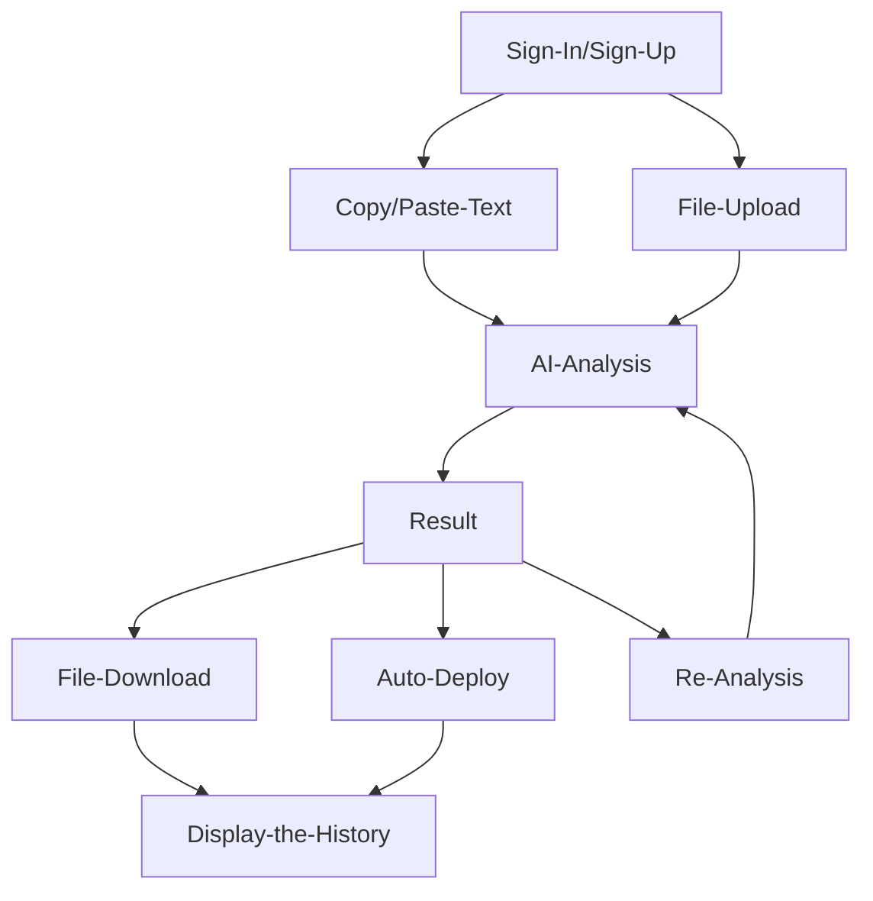

# ETH Various
AI based Analyse smart contract coed files, Contract Address to detect vulnerabilities and other breaches, `automatically code edit` and `result the reports`.

### [Demo](https://eth-various.vercel.app/#)

## Why need the ETH Various?
As the blockchain technology and cryptocurrency markets continue to grow, `security issues` and `malicious activities` are also on the rise. 
`Phishing`, `scams`, and `malicious contract codes` are major concerns, especially as they often originate from compromised smart contract code and wallet approvals. 
In response to this, we propose an **`AI-powered platform for analyzing, modifying, and improving smart contract codes, providing detailed reports on identified issues and applied fixes`**.

## Our Solution
> **Preventive Security Checks**

- Users upload their smart contract code, which the AI analyzes for security vulnerabilities, code flaws, and potential scams.
> **Automated Corrections and Enhancements**

- Based on the analysis, the AI suggests and implements modifications to improve the contract code, including applying security patches and optimizing performance.
> **Detailed Reporting**

- The platform generates comprehensive reports detailing the issues found, modifications made, and explanations to help users understand the improvements.
> **Automatic Deployment**

- The modified smart contract can be deployed directly through the platform. This allows users to instantly deploy the analyzed or corrected code without needing to use external tools like Remix.
> **Ease of Use**

- Unlike existing professional auditing firms like Certik and Hacken, our platform offers an easily accessible preliminary self-audit service. This enables developers and project teams to address security issues early in the development process, making the final professional audit more efficient and streamlined.

## User Flow

## User Journey
1. **User Registration and Login**:
   - Users register and log in to the ETH Various platform.

2. **Upload Smart Contract Code**:
   - Users upload the smart contract code they want to analyze, either by copying and pasting or by uploading a file.

3. **Initiate AI Analysis**:
   - The uploaded smart contract code is automatically analyzed by Galadriel AI, which identifies security vulnerabilities, code errors, and performance improvement opportunities.

4. **Review Analysis Results**:
   - Users receive the analysis results from the Galadriel AI, including identified issues, suggested modifications, and security recommendations.

5. **Code Modification and Automatic Deployment**:
   - After reviewing the suggested modifications, users can deploy the modified code directly from the platform. Deployment can be done using tools like Remix.

6. **Download Report**:
   - Users can download a report of the analysis and modifications in CSV or PDF format for their records.

7. **Follow-up and Reanalysis**:
   - If needed, users can upload the modified smart contract for further analysis.

8. **Continuous Platform Use**:
   - Users continuously use the platform to analyze and improve various smart contract codes, enhancing the security and optimization of their Web3 applications.

#### Through this journey, ETH Various helps users continuously improve the security and quality of their smart contracts.

## Goal
Our ultimate goal is to provide an accessible environment where `anyone can easily engage with` and `learn about Web3 development`. 
Through our ETH Various platform, users can understand what smart contract code is, identify its vulnerabilities, and learn how to correct them, thus fostering the growth of developers within the Web3 ecosystem. 
The platform also empowers everyday users to upload suspicious contract codes for analysis, helping to prevent scams and phishing attacks, and promoting a safer Web3 experience.

Furthermore, we aim to contribute to the safety of the Web3 ecosystem by collecting and preprocessing user data, which will be used to train AI models. 
This data will help `develop new blockchain security models` and `solutions`, enabling us to offer B2B services between companies.
