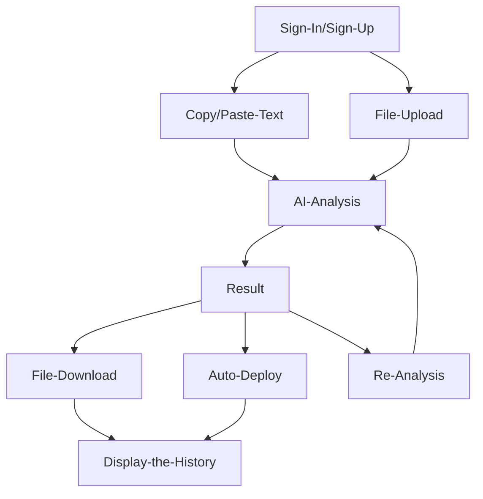

# ETH Various
AI based Analyse smart contract coed files, Contract Address to detect vulnerabilities and other breaches, `automatically code edit` and `result the reports`.

### [Demo](https://eth-various.vercel.app/#)

## Why need the ETH Various?
As the blockchain technology and cryptocurrency markets continue to grow, `security issues` and `malicious activities` are also on the rise. 
`Phishing`, `scams`, and `malicious contract codes` are major concerns, especially as they often originate from compromised smart contract code and wallet approvals. 
In response to this, we propose an **`AI-powered platform for analyzing, modifying, and improving smart contract codes, providing detailed reports on identified issues and applied fixes`**.

## Our Solution
1. **Preventive Security Checks**: Users upload their smart contract code, which the AI analyzes for security vulnerabilities, code flaws, and potential scams.
2. **Automated Corrections and Enhancements**: Based on the analysis, the AI suggests and implements modifications to improve the contract code, including applying security patches and optimizing performance.
3. **Detailed Reporting**: The platform generates comprehensive reports detailing the issues found, modifications made, and explanations to help users understand the improvements.
4. **Ease of Use**: Unlike existing professional auditing firms like Certik and Hacken, our platform offers a preliminary self-audit service that is easily accessible. This allows developers and project teams to address security issues early in the development process, making the final professional audit more efficient and streamlined.

## User Flow

## User Journey
1. **Discovery:** A Web3 beginner or blockchain enthusiast learns about Smart Various via social media or word-of-mouth, recognizing its potential to analyze and secure smart contracts.
2. **Onboarding:** The user visits the website, signs up using Web3auth, and uploads their smart contract code for analysis.
3. **Analysis:** The Galadriel TeeML AI-powered platform quickly analyzes the code, providing a detailed report on vulnerabilities and suggested improvements.
4. **Implementation:** The user reviews the report, applies the recommended changes, and downloads the report for future reference.
5. **Feedback & Retention:** Satisfied with the experience, the user provides feedback, continues using the platform, and recommends it to others.
